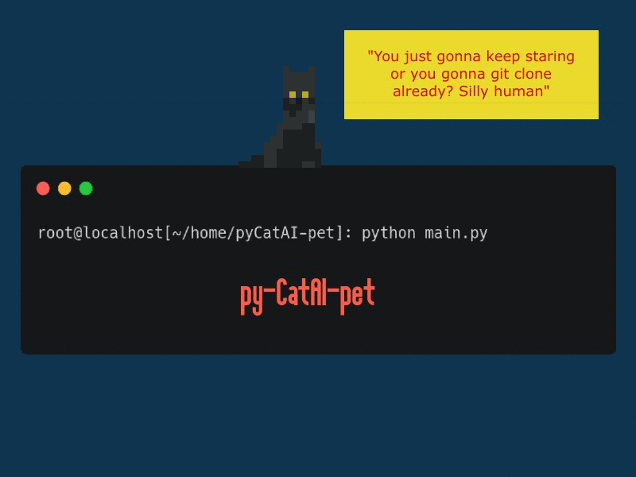

# pyCatAI-pet
A Windows based AI powered desktop pet written in python. It can move around on your screen and jump on top of active program windows. And with the help of Google's Gemini Vision model, it can generate funny comments on current on-screen activity by taking screenshots of your screen every minute.

[Watch video demo](https://youtu.be/Ep7Un8vAwbI)

  

   

> [!IMPORTANT]  
> Make sure you have generated your own API key and placed it on here:
https://github.com/R37r0-Gh057/pyCatAI-pet/blob/fa142662c4cc735ebe82a3d457dc0b3b78f78752/lib/CommentGenerator.py#L10

# Installation
`git clone https://github.com/R37r0-Gh057/pyCatAI-pet`
`cd pyCatAI-pet`
`pip install -r requirements.txt`

# Usage
`python main.py`